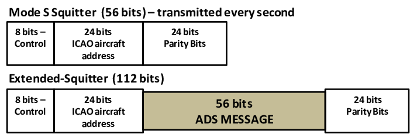

# ADS-B

to other ADS-B In equipped aircraft with position and velocity data transmitted every second

### Physical layer

Two link solutions are used as the physical layer for relaying ADS-B position reports: 

[978 MHz link  universal access transceiver, rtca-do-282](https://standards.globalspec.com/std/2011300/rtca-do-282) Minimum Operational Performance Standards for Universal Access Transceiver (UAT) Automatic Dependent Surveillance – Broadcast. RTCA. 29 July 2004. DO-282A. 

UAT is a multi-purpose aeronautical data link intended to support not only ADS-B, but also Flight Information Service - Broadcast (FIS-B), Traffic Information Service - Broadcast (TIS-B) and, if required in the future, supplementary ranging and positioning capabilities. The document was developed in parallel with DO-260B.

[UAT Test Procedure ](https://www.icao.int/safety/acp/inactive%20working%20groups%20library/acp-wg-c-uat-8/uat-swg08-wp22%20-%20rc%20unit%203%20test%20procedure%20and%20report.pdf)

[1090 MHz extended squitter, essentially a modified Mode S transponder  DO-260B](https://my.rtca.org/productdetails?id=a1B36000001IcjDEAS) Minimum Operational Performance Standards for 1090 MHz Extended Squitter Automatic Dependent Surveillance – Broadcast (ADS-B) and Traffic Information Services – Broadcast (TIS-B). RTCA. 

[ICAO ADS-B Meeting November 27-30, 2018 DO-260B/ED-102A](https://www.icao.int/NACC/Documents/Meetings/2018/ADSB/P01-FAA-AgendaItem3.pdf)

[4th Meeting of the APIRG Communications, Navigation and Surveillance Sub-group Dakar, Senegal, 25-29 July 2011](https://www.icao.int/wacaf/documents/apirg/sg/2011/cns_sg4/docs/wp20_en.pdf)

[ICAO (2012). ICAO Doc 9871, Technical Provisions for Mode S and Extended Squitter (2 ed.). International Civil Aviation Organization. ISBN 978-92-9249-042-3.](https://www.icao.int/isbn/Lists/Publications/DispForm.aspx?ID=2052)

[The format of extended squitter messages has been codified by the ICAO.](https://www.icao.int/isbn/Lists/Publications/DispForm.aspx?ID=2052)

[Extended Squitter Automatic Dependent Surveillance - Broadcast (ADS-B) and Traffic Information Service - Broadcast (TIS-B) Equipment Operating on the Radio Frequency of  1090 Megahertz (MHz)](https://www.seaerospace.com/documents/TSO-C166A.pdf)

https://www.researchgate.net/figure/Format-of-Squitter-and-Extended-Squitter-messages-adapted-from-Orlando-2013_fig3_265085540

https://www.researchgate.net/publication/265085540_Limits_and_Future_GNSS_Solutions_for_Aircraft_Landing_in_low_Visibility_Conditions/ <!-- copies/LIMITSANDFUTUREGNSSSOLUTIONSFORAIRCRAFTLANDINGINLOWVISIBILITYCONDITIONS.pdf -->

### certified GNSS position source  

